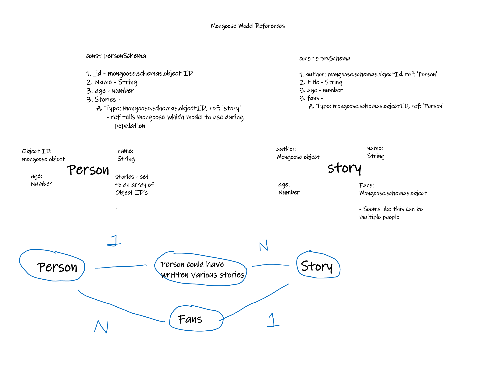

### Description:
- create references between objects with Mongoose
- display 1-N relations
    - 1 to N relation between Person and stories
    - 1 to N relation between Story and fans (Person Objects)
- explore populating methods
    
### Populating Methods
- Push Story objects into authors array of stories 
- Use findOne, find mongoose methods
- Denormalization

### Relations

    

### Resources: 
<ol>
    <li><a href="https://mongoosejs.com/docs/populate.html">Mongoose Populate - Referencing Other Objects</a></li>
    <li><a href="https://stackoverflow.com/questions/23259168/what-are-express-json-and-express-urlencoded/51844327">Reading Objects from Post commands</a></li>
    <li><a href="https://www.mongodb.com/blog/post/6-rules-of-thumb-for-mongodb-schema-design-part-3">Denormalization</a> </li>
</ol>

